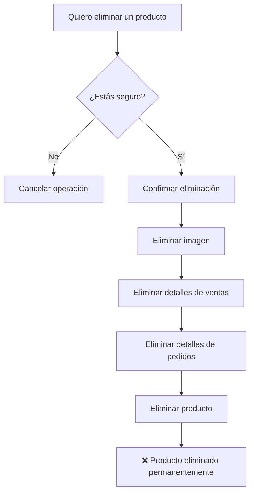

# 🗑️ Sistema de Eliminación de Productos

## Descripción General

El sistema implementa **eliminación física completa** de productos. Cuando se elimina un producto, se elimina permanentemente de la base de datos junto con TODOS sus registros relacionados (ventas, pedidos, etc.).

⚠️ **ADVERTENCIA**: Esta operación es **IRREVERSIBLE**. Una vez eliminado un producto, no se puede recuperar.

## 🔄 Proceso de Eliminación

### **Eliminación Completa y Permanente**

Cuando eliminas un producto:

1. **Se elimina la imagen** asociada del almacenamiento
2. **Se eliminan TODOS los detalles de ventas** donde aparece el producto
3. **Se eliminan TODOS los detalles de pedidos** donde aparece el producto
4. **Se elimina el producto** de la base de datos

⚠️ **ADVERTENCIA CRÍTICA:**
- ✖️ Esta acción es **IRREVERSIBLE**
- ✖️ Se pierden todos los registros históricos
- ✖️ Los reportes de ventas pasadas se verán afectados
- ✖️ No hay forma de recuperar la información

**Cómo funciona:**
```php
// 1. Eliminar imagen
if ($producto->imagen) {
    Storage::disk('public')->delete($producto->imagen);
}

// 2. Eliminar detalles de ventas
DB::table('venta_detalles')->where('producto_id', $producto->id)->delete();

// 3. Eliminar detalles de pedidos
DB::table('pedido_detalles')->where('producto_id', $producto->id)->delete();

// 4. Eliminar producto
$producto->delete();
```

### **Confirmación Requerida**

El sistema solicita confirmación con el siguiente mensaje:

> ⚠️ **ADVERTENCIA**: Esto eliminará permanentemente el producto y TODOS sus registros relacionados (ventas, pedidos, etc.). Esta acción NO se puede deshacer. ¿Estás completamente seguro?

## 📊 Filtros Disponibles

### En la vista de productos (`/productos`):

1. **Buscar**: Por nombre o código
2. **Categoría**: Filtrar por categoría específica
3. **Stock**: Solo productos con stock bajo

**Nota**: Solo se muestran productos activos. Los productos eliminados desaparecen permanentemente.

## 🎯 Flujo de Trabajo

### Para Inventario y Administradores:



### ⚠️ Consecuencias de la Eliminación:

1. **Reportes Históricos**: Las ventas pasadas del producto mostrarán el ID del producto eliminado
2. **Estadísticas**: Los gráficos y reportes perderán la información del producto
3. **Facturas**: Las facturas antiguas no mostrarán el nombre del producto eliminado
4. **Inventario**: El historial de stock del producto se perderá completamente

## 🔐 Permisos por Rol

| Acción | Administrador | Inventario | Vendedor |
|--------|--------------|------------|----------|
| Ver productos | ✅ | ✅ | ❌ |
| Crear producto | ✅ | ✅ | ❌ |
| Editar producto | ✅ | ✅ | ❌ |
| Eliminar producto | ✅ | ✅ | ❌ |

## ⚠️ Advertencias Importantes

### 1. **No hay Papelera de Reciclaje**
- ❌ Los productos eliminados no se pueden recuperar
- ❌ No existe función de "deshacer"
- ❌ No hay respaldo automático

### 2. **Impacto en Reportes**
- ⚠️ Los reportes históricos perderán datos del producto
- ⚠️ Las estadísticas de ventas pasadas se verán afectadas
- ⚠️ Los gráficos mostrarán datos incompletos

### 3. **Integridad de Facturas**
- ⚠️ Las facturas antiguas mostrarán productos sin nombre
- ⚠️ Se pierde trazabilidad de qué se vendió
- ⚠️ Problemas potenciales con auditorías

### 4. **Recomendaciones**
- 💡 **Mejor práctica**: En lugar de eliminar, considera marcar productos como inactivos manualmente
- 💡 **Backup**: Realiza respaldo de la base de datos antes de eliminar productos importantes
- 💡 **Verificar**: Revisa bien antes de confirmar la eliminación

## 🛠️ Uso Técnico

### Ruta de Eliminación

```php
// Eliminar producto (método DELETE del resource)
DELETE /productos/{producto}
```

### Método del Controlador

```php
// Eliminación completa
ProductoController@destroy

// Lo que hace internamente:
public function destroy(Producto $producto)
{
    // 1. Eliminar imagen
    Storage::disk('public')->delete($producto->imagen);
    
    // 2. Eliminar detalles de ventas
    DB::table('venta_detalles')->where('producto_id', $producto->id)->delete();
    
    // 3. Eliminar detalles de pedidos
    DB::table('pedido_detalles')->where('producto_id', $producto->id)->delete();
    
    // 4. Eliminar producto
    $producto->delete();
}
```

### Vista Blade

```blade
<form action="{{ route('productos.destroy', $producto->id) }}" 
      method="POST" 
      onsubmit="return confirm('⚠️ ADVERTENCIA: Esto eliminará permanentemente...')">
    @csrf
    @method('DELETE')
    <button type="submit" class="text-red-600 hover:text-red-900">
        <i class="fas fa-trash"></i>
    </button>
</form>
```

## 📝 Mensajes del Sistema

### Eliminación exitosa:
> "Producto eliminado exitosamente junto con todos sus registros relacionados."

### Error al eliminar:
> "Error al eliminar el producto: [mensaje de error]"

## 🎨 Indicadores Visuales

### Estado del Producto:
- **Activo**: Badge azul cielo (`#5B8FCC`)

### Iconos de Acciones:
- 👁️ **Ver**: Azul cielo (`#5B8FCC`)
- ✏️ **Editar**: Azul profundo (`#190C7B`)
- 🗑️ **Eliminar**: Rojo (`red-600`)

## � Respaldo y Recuperación

### Recomendaciones de Backup:

Antes de eliminar productos importantes, realiza un respaldo:

```bash
# Backup de la base de datos completa
mysqldump -u usuario -p mascotas_felices > backup_$(date +%Y%m%d_%H%M%S).sql

# Backup solo de las tablas de productos
mysqldump -u usuario -p mascotas_felices productos venta_detalles pedido_detalles > backup_productos_$(date +%Y%m%d_%H%M%S).sql
```

### Recuperación de Datos Eliminados:

Si eliminaste un producto por error, la única forma de recuperarlo es:

1. Restaurar desde un backup de base de datos
2. Volver a crear el producto manualmente con todos sus datos

## 📞 Soporte

Para preguntas o problemas con el sistema de eliminación:
1. Revisar este documento primero
2. Verificar permisos de rol
3. Consultar con administrador del sistema

---

**Última actualización:** 10 de noviembre de 2025
**Versión:** 2.0
